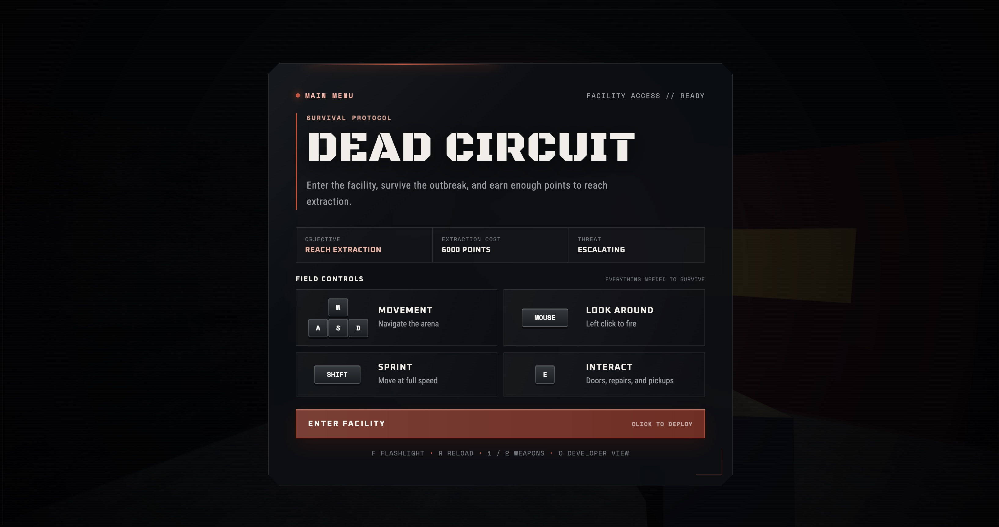
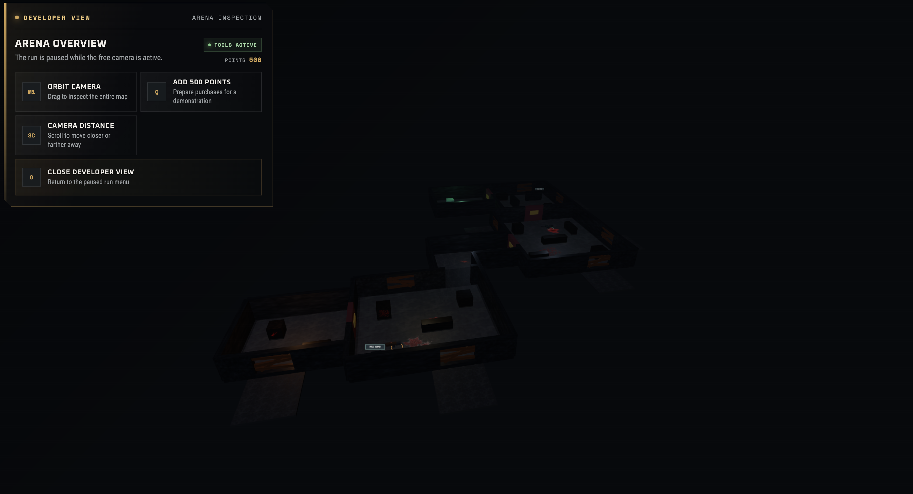
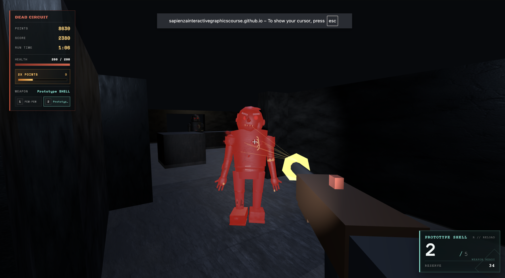
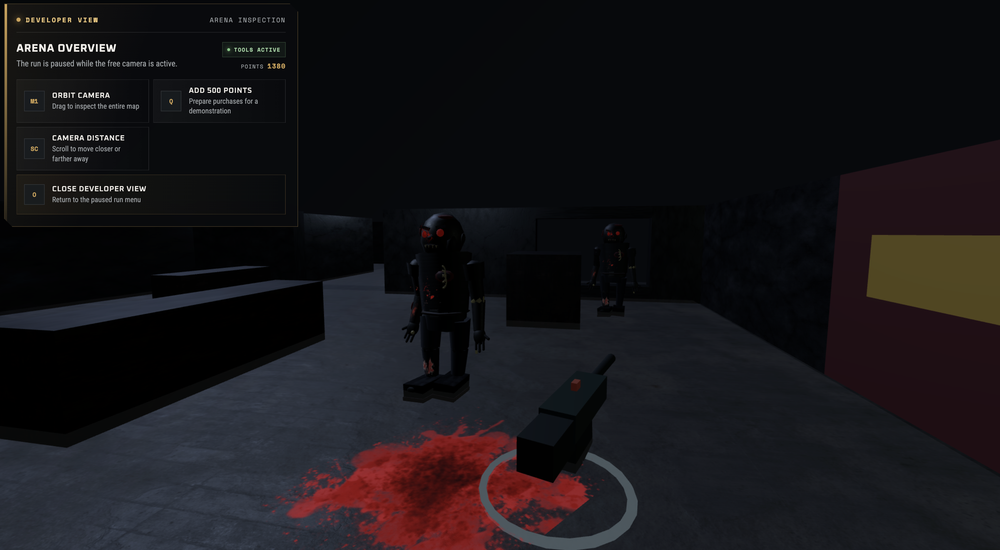
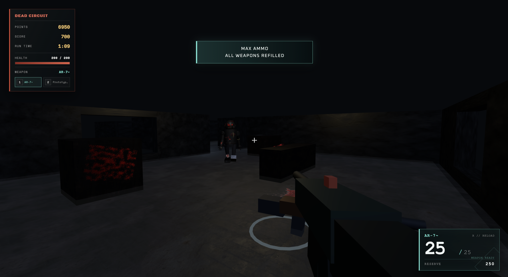
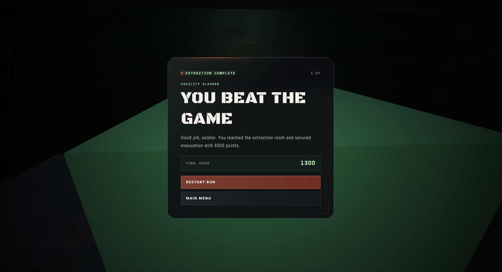

# Dead Circuit

## Technical Report and User Manual

**Project type:** Interactive Graphics final project  
**Runtime:** Three.js/WebGL in a browser  
**Build tool:** Vite  
**Main objective:** first-person zombie survival game with a complete playable loop

Dead Circuit is a first-person survival game set inside a locked-down facility. The player starts in the first room with a pistol, fights zombies for points, repairs barricades, buys access to new rooms, collects power-ups, upgrades weapons, and wins by paying for extraction in the final room. The project focuses on a custom Three.js scene, procedural 3D modeling, manual animation, real-time interaction, collision handling, and game-state management.

The project was built as a web application rather than a native executable. It can be run locally with `npm run dev` and built for production with `npm run build`. The browser renders the 3D scene using WebGL through Three.js. Game logic is organized into separate modules for player state, arena generation, weapons, zombies, spawning, collision, UI, audio, and power-ups.

## Project Figures

**Figure 1: Main menu and controls**

The main menu introduces the game objective, extraction cost, threat level, and core controls before the player enters the facility.



**Figure 2: Developer overview and arena layout**

The developer overview shows the full multi-room arena, including the room progression path, door locations, barricade windows, and extraction route.



**Figure 3: First-person gameplay**

The first-person gameplay view shows the player HUD, crosshair, weapon model, lighting, fog, textured environment, and active zombie encounter.



**Figure 4: Procedural hierarchical zombie model**

The zombie model is assembled from separate procedural body parts, including the torso, head, arms, legs, clothing, wounds, and decals used by the manual animation system.



**Figure 5: Interaction prompt and gameplay action**

The interaction prompt demonstrates the context-sensitive `E` key system used for doors, barricades, weapons, power-ups, and extraction.



**Figure 6: Victory and extraction ending**

The victory screen confirms the completed win condition after the player reaches the extraction room and pays the required extraction cost.



<div style="page-break-after: always;"></div>

## 1. Environment Used

The project uses **Three.js** as the graphics library. Three.js provides the WebGL renderer, scene graph, cameras, lights, meshes, materials, textures, raycasting, and control helpers used throughout the game. The application is bundled and served with **Vite**, which gives a fast development server and produces the final browser build.

The project runs in a modern browser. During gameplay the user interacts through pointer lock, keyboard input, mouse movement, and mouse clicks. Pointer lock is important because it lets the mouse control the first-person camera continuously, which is required for a shooter-style game. The first-person camera is attached logically to the player position, and the camera direction is used for movement and shooting.

The rendering environment contains:

- `THREE.WebGLRenderer` with antialiasing and shadow maps enabled.
- A perspective camera used as the player's first-person view.
- Fog to create a darker facility atmosphere and limit distant visibility.
- Ambient, point, and flashlight lighting.
- Procedural geometry for the arena, props, weapons, pickups, and zombies.
- Texture maps for walls, floors, crates, barricades, zombie materials, and decals.
- CSS-based HUD and menu overlays rendered above the canvas.

The local development commands are:

```bash
npm install
npm run dev
```

The production build command is:

```bash
npm run build
```

The project can also be verified manually by running the development server, entering developer view with `O`, adding points with `Q`, unlocking the rooms, and completing extraction.

## 2. Libraries, Tools, and External Assets

The main external library used by the game is **Three.js**. It provides the graphics foundation and the controls used by the scene:

- `three`: rendering, scene graph, geometry, materials, lights, textures, raycasting, vectors, and math.
- `PointerLockControls`: first-person mouse-look control.
- `OrbitControls`: developer overview camera for inspecting the map.

The project uses **Vite** as the development and build tool. Vite serves the project during development, handles ES module imports, and generates the production build.

The project also has `@tweenjs/tween.js` installed in `package.json`, but the current implementation uses manual interpolation and update functions for doors, weapons, zombies, and UI timing. It is not imported by the game code.

External visual and audio assets are stored in `public/`. These assets were not modeled or recorded inside the project code. They are used as static resources loaded by the browser:

- Arena textures under `public/textures/arenaTextures/`.
- Zombie material textures under `public/textures/zombieTextures/`.
- Blood and stain decals under `public/textures/decals/`.
- Gameplay audio under `public/audio/`.
- Google Fonts loaded in `index.html` for the game interface.

The project does **not** use external 3D model files. The zombie, weapons, barricades, rooms, pickups, and props are built procedurally from Three.js primitive geometry. This is important because the hierarchical zombie model is implemented directly in code rather than imported from a model file.

The audio files include weapon shots and reloads, zombie death, door opening, power-up collection, player death, and victory. The audio system creates reusable audio templates and clones them when sounds play, allowing repeated events such as rifle shots to overlap without cutting each other off.

<div style="page-break-after: always;"></div>

## 3. Project Structure

The code is organized around the main runtime file, object builders, scene builders, and gameplay systems.

`src/main.js` is the game coordinator. It creates the scene, player, controls, renderer, game state, audio, weapon system, zombie spawner, barricade system, door system, HUD, and main animation loop. It also coordinates menu states, pause state, debug view, game over, and victory.

The `src/scene/` folder contains the camera, controls, lights, and scene creation. Scene creation builds the static arena and places the weapon pickups and permanent Max Ammo pickups.

The `src/objects/` folder contains the object constructors:

- `Player.js` defines player position, movement values, health, regeneration, and damage/death behavior.
- `Weapon.js` defines the pistol, shotgun, rifle, ammo data, procedural weapon meshes, and arena pickups.
- `Zombie.js` creates the hierarchical zombie object.
- `MaxAmmoPickup.js` and `DoublePointsPickup.js` create power-up pickups.
- `Arena.js` and `objects/arena/` build rooms, walls, doors, collision data, textures, decals, and geometry helpers.
- `objects/zombieParts/` separates zombie body-part construction into torso, head, arms, legs, clothing, materials, and decals.

The `src/systems/` folder contains gameplay systems:

- `animation.js`: manual animation states for zombies and lighting effects.
- `audio.js`: sound loading and playback.
- `barricades.js`: player repair behavior and repair rewards.
- `collision.js`: player and zombie body collision with boxes.
- `doors.js`: door purchase, opening animation, and collision removal.
- `extraction.js`: final objective payment and victory guard.
- `gameState.js`: score, points, timer, messages, and Double Points timing.
- `input.js`: keyboard state and one-shot action handling.
- `navigation.js`: zombie obstacle routing and separated spawn positions.
- `powerUps.js`: Max Ammo, Double Points, zombie drop rolls, collection, and expiration.
- `shooting.js`: weapon firing, reloads, raycasts, damage, pickups, ammo stations, and visual shot effects.
- `spawning.js`: zombie spawn rules, barricade entry behavior, pursuit, attacks, and difficulty scaling.
- `ui.js`: HUD creation and updates.

## 4. Scene and Arena

The arena is a multi-room facility. It is built from primitive Three.js meshes instead of imported level geometry. The player starts in the First Room, then progresses through the Second Room, Connector, Third Room, Fourth Room, and Extraction Room. Each room has bounds and a scene name so gameplay systems can know which areas are unlocked or visited.

The arena contains:

- Floors with concrete-style textures.
- Walls with asphalt-style textures.
- Crates and barriers that block movement and bullets.
- Door panels that slide down after purchase.
- Barricade windows where zombies enter.
- Exterior spawn floors outside the barricades.
- Blood decals and stain decals for atmosphere.
- Fog planes and lighting to create a dark facility mood.

Collision is handled using data boxes that mirror the visible walls, doors, props, and extraction box. This approach is simpler and more reliable than attempting collision directly against all visible meshes. The player and zombies use circular body footprints checked against axis-aligned boxes. Movement is resolved on one horizontal axis at a time, which allows simple wall sliding when one direction is blocked and the other is free.

Doors start as solid collision boxes. When a door is bought, the game spends points, marks the door as open, animates the door downward, and removes that door from the active collision list. This allows both the player and zombies to move through the newly unlocked path.

Barricades are visual and gameplay objects. They are composed of multiple plank meshes. Zombies attack the planks one at a time, and the player can repair missing planks by holding `E` near a damaged barricade. Reattaching the original plank mesh preserves the plank's transform and material.

<div style="page-break-after: always;"></div>

## 5. Player and Camera

The player is represented as a gameplay body rather than a visible character mesh. The camera is synchronized to the player position using an eye-height value, creating a first-person viewpoint. Movement uses keyboard input and camera direction:

- `W` and `S` move forward and backward relative to the camera.
- `A` and `D` move sideways relative to the camera.
- `Shift` increases movement speed while the player is moving.
- Diagonal movement is normalized so it is not faster than straight movement.

The player has health, damage, death, and regeneration systems. The maximum health is 200. Zombie attacks deal 50 damage, so four successful attacks kill a full-health player. After damage, regeneration waits for a delay before restoring health over time. Damage feedback is shown using a red overlay. The damage callback only runs for valid damage, so rejected hits and healing do not trigger the flash.

The camera uses `PointerLockControls` for gameplay. Pointer lock is requested after a user click, which follows browser security rules. When pointer lock exits, the game pauses or shows the correct end screen. The project also includes a developer overview mode using `OrbitControls`. Pressing `O` pauses the run, hides the weapon, disables first-person controls, and places the camera above the map. This makes it possible to inspect the complete arena layout during testing and presentation.

The flashlight is a light attached to the camera. Since it is a camera child, it automatically follows mouse look. The player can toggle it with `F`. This creates a first-person horror atmosphere and makes the dark map more readable during gameplay.

## 6. Zombie Model and Manual Animation

The zombie is a hierarchical model made from procedural geometry. It is not imported as a prebuilt asset. The main zombie group contains a body group, and the body group contains torso, head, arms, legs, clothing, and detail meshes. Individual parts are stored as references so the animation system can rotate and move them independently.

The zombie hierarchy includes:

- Body group.
- Torso and shirt shell.
- Head, jaw, teeth, eyes, and wounds.
- Left and right arms with shoulder, elbow, hand, fingers, and thumb.
- Left and right legs with hip, knee, lower leg, and foot.
- Clothing elements such as shoulder cloth, waist, belt, and belt buckle.
- Blood decals attached to body-part pivots.

Manual animation is implemented in `systems/animation.js`. Each frame resets the zombie to its saved base pose, then applies the current animation state. Resetting first prevents rotations from stacking incorrectly across frames or states.

Implemented animation states are:

- `idle`: breathing, small body sway, head movement, and jaw chatter.
- `walking`: alternating arm and leg swings with a small step bounce.
- `running`: stronger and faster movement cycle after the difficulty threshold.
- `attacking`: wind-up, strike, and recovery phases for a melee attack.
- `hit`: short stagger reaction after taking damage.
- `dead`: falling pose that remains after death.

The animation is directly tied to gameplay behavior. Zombies walk or run while pursuing, attack when close to the player or barricade, enter a hit reaction when shot, and stop moving after death. After five minutes of active run time, zombies switch from walking to running. This is controlled by elapsed gameplay time, not real clock time, so pausing does not increase difficulty.

## 7. Zombie Spawning, Navigation, and Attacks

Zombies spawn outside barricade windows. Spawn zones are connected to room progress. The first room spawn is active at the start, while later spawn zones become active only after the relevant door is opened and the player has entered the related room. This prevents zombies from spawning in locked areas before the player can reach them.

Spawn positions are separated across lateral and depth slots so zombies do not stack on one point. The spawner checks whether a slot is occupied by another living zombie and whether the position intersects collision geometry. If all positions are blocked, spawning waits and retries later.

When a zombie spawns near a barricade, it first approaches the outside of the barricade. If planks are present, it attacks the barricade and removes one plank per completed attack. Once the barricade is empty, the zombie enters through the window and begins chasing the player. If the barricade was already broken, the zombie skips attacking it.

Zombie movement uses simple local navigation. The system checks whether the direct path to the player crosses a blocking collision box. If blocked, it creates route candidates around padded obstacle corners and chooses the shortest valid route. The zombie follows temporary waypoints, then returns to chasing the live player position. If the player moves significantly or the direct path opens, the route is refreshed. This keeps zombies from committing to stale paths.

Close zombies stop moving and use the attack animation. The attack system uses a cooldown, so one zombie cannot damage the player every frame. Attacks deal 50 damage and are rejected while cooling down. The same attack timing is used for barricade hits, where one full attack removes one plank.

<div style="page-break-after: always;"></div>

## 8. Weapons, Shooting, and Economy

The game has three weapons:

- Pistol: starting weapon with single shots.
- Shotgun: purchasable weapon with pellet spread.
- Rifle: purchasable automatic weapon.

Weapons are built procedurally from primitive meshes. Each weapon has a body, barrel, handle, trigger, sight, muzzle group, and reload part. The muzzle flash is created once and shown briefly when the weapon fires. Weapon recoil moves and rotates the weapon slightly, then interpolates it back to the base transform.

Shooting uses Three.js raycasting from the camera. The pistol and rifle fire one centered ray. The shotgun generates several pellet directions inside a spread cone, then raycasts each pellet independently. Raycast targets include living zombie meshes and bullet-impact surfaces in the environment. If a pellet hits an obstacle first, that pellet does not damage a zombie behind it.

The weapon system tracks:

- Damage.
- Magazine size.
- Current magazine ammo.
- Reserve ammo.
- Maximum reserve ammo.
- Fire cooldown.
- Reload duration.
- Automatic fire flag.
- Pellet count and spread for the shotgun.

Reloading validates the weapon state before playing sound or starting the animation. Reserve ammo is deducted only when the reload completes. If a weapon reaches zero ammo after firing, it starts a reload automatically if reserve ammo exists.

The economy uses points and score. Shooting zombies awards points on hits and kills. Doors, weapons, ammo purchases, and extraction spend points. Costs do not pass through the reward system, so Double Points can never reduce or change purchase prices. Barricade repair awards points but does not increase score, separating repair utility from zombie score.

Weapon pickups remain in the arena after purchase and become ammo stations. If the player owns a weapon and empties it completely, the station can sell ammo for that weapon. This gives the pickups a continued purpose after the weapon is bought.

## 9. Power-Ups and Extraction

The project implements two power-ups:

- **Max Ammo** refills reserve ammo for all owned weapons.
- **Double Points** doubles earned rewards for a limited duration.

Permanent Max Ammo pickups are placed in selected rooms. Zombies also have independent drop rolls for Max Ammo and Double Points. A drop guard ensures a zombie rolls drops only once, even if multiple shotgun pellets hit during the killing shot. Dropped pickups have a lifetime and flash near expiration. Permanent pickups remain in place until collected.

Collection uses shared guards so repeated `E` presses cannot apply the same pickup twice. Max Ammo refills owned weapons without granting weapons the player does not own. If the equipped weapon is empty, Max Ammo can instantly load the magazine from the refilled reserve so the player is not stuck holding an empty gun.

Double Points refreshes its timer when collected again instead of stacking beyond 2x. It only counts down while the game is actively playing. It deactivates on game over or victory.

The final objective is the extraction marker in the Extraction Room. The player must reach the marker and pay 6000 points. The objective has a completed flag, so victory can only trigger once even if interaction checks repeat before the victory screen appears. On successful extraction, gameplay stops, the weapon is hidden, Double Points is cleared, and the victory menu shows the final score and elapsed time.

## 10. User Interface and Audio

The UI is built with HTML and CSS layered above the Three.js canvas. The game creates the HUD once and updates existing elements during gameplay instead of rebuilding the DOM every frame.

The interface includes:

- Main menu with controls and objective summary.
- Pause menu with current points, weapon, and run time.
- Game-over screen.
- Victory screen.
- Crosshair.
- Ammo HUD.
- Health HUD.
- Weapon slot display.
- Double Points timer.
- Interaction prompt.
- Temporary game messages.
- Damage feedback overlay.
- Developer overview panel.

Interaction prompts are prioritized so the screen does not show several instructions at once. Extraction has highest priority, followed by doors, barricades, power-ups, and weapon pickups. This keeps the player focused on the most important action available.

Audio is event-driven. Sounds play only after the matching gameplay action succeeds. For example, failed reloads do not play reload audio, failed door purchases do not play door audio, and duplicate power-up collection does not play collection audio again. This keeps audio synchronized with gameplay state.

The game uses audio for:

- Pistol, shotgun, and rifle shots.
- Pistol, shotgun, and rifle reloads.
- Zombie death.
- Door opening.
- Max Ammo.
- Double Points.
- Player death.
- Victory.

<div style="page-break-after: always;"></div>

## 11. Implemented Interactions

The following interactions are implemented in the game:

**Movement and camera**

- Move with `W A S D`.
- Look with the mouse.
- Sprint with `Shift`.
- Pause by leaving pointer lock or pressing `Esc`.
- Toggle flashlight with `F`.
- Inspect the map with developer view using `O`.

**Combat**

- Shoot with left mouse button.
- Reload with `R`.
- Switch weapons with `1` and `2`.
- Damage zombies with raycast weapons.
- Kill zombies and receive kill rewards.
- Use shotgun spread against groups or close targets.
- Use rifle automatic fire by holding the mouse button.

**Progression**

- Buy locked doors with points.
- Unlock new rooms.
- Activate later-room zombie spawn zones.
- Reach the extraction room.
- Pay for final extraction to win.

**Barricades**

- Zombies remove planks through attacks.
- Broken windows let zombies enter.
- Player can hold `E` near damaged barricades to repair planks.
- Repairing planks awards points.

**Power-ups**

- Collect Max Ammo with `E`.
- Collect Double Points with `E`.
- Receive zombie drop pickups.
- Watch dropped pickups expire if not collected.
- See Double Points timer in the HUD.

**HUD and game states**

- Main menu.
- Active gameplay.
- Pause.
- Game over.
- Victory.
- Context-sensitive prompts.
- Damage overlay.
- Health and ammo updates.

## 12. User Manual

Start the project with:

```bash
npm install
npm run dev
```

Open the local Vite URL in the browser. The main menu appears first. Click the game to enter pointer-lock mode and start the run.

The goal is to survive, earn enough points, reach the Extraction Room, and pay 6000 points at the extraction marker. The player starts with a pistol and 500 points. Zombies enter through barricades and attack the player when close. Shooting zombies earns points. Use points to buy doors and reach later rooms.

Basic controls:

- `W A S D`: move.
- `Mouse`: look.
- `Left mouse`: shoot.
- `Shift`: sprint.
- `R`: reload.
- `E`: interact.
- `F`: toggle flashlight.
- `1 / 2`: switch weapon slots.
- `Esc`: pause.
- `O`: developer overview camera.
- `Q`: add 500 points while in developer view.

Developer demonstration mode is available for testing and presentation. Pressing `O` pauses the run and switches to an overhead arena camera. While this view is active, pressing `Q` adds 500 points. This makes it possible to quickly unlock doors, buy weapons, reach the final extraction room, and demonstrate the victory screen without completing a long survival run.

When near an interactive object, the prompt at the bottom of the screen explains what pressing or holding `E` will do. Doors require points. Barricades require holding `E` for a short repair duration. Power-ups and weapons require a single `E` press.

Weapons:

- The pistol is available from the start.
- The shotgun can be purchased in the second room.
- The rifle can be purchased later in the arena.
- Bought weapon pickups remain as ammo stations.
- Ammo stations refill a completely empty owned weapon for half of that weapon's purchase price.

Power-ups:

- Max Ammo refills reserve ammo for owned weapons.
- Double Points doubles earned rewards for 30 seconds.
- Some power-ups are placed in rooms, and zombies can also drop temporary pickups.

Survival tips:

- Repair barricades when possible to slow zombie entry.
- Use doors strategically, because opening new rooms activates more spawn zones.
- Use the flashlight in dark areas, but keep moving when zombies get close.
- Save enough points for extraction after unlocking the final room.
- Use developer view only for presentation or inspection, not normal play.

## 13. Build and Verification

The project was checked with the production build command:

```bash
npm run build
```

The production build completes successfully. The build reports a bundle-size warning because the game code and Three.js are bundled into a large JavaScript chunk, but this warning does not prevent the build from running.

The gameplay can be verified from the browser by following the complete loop:

- Start from the main menu.
- Use `W A S D`, mouse look, shooting, reload, flashlight, and weapon switching.
- Fight zombies and earn points.
- Repair barricades and observe zombies breaking planks.
- Buy doors and unlock later rooms.
- Buy weapons and collect power-ups.
- Enter developer view with `O` and use `Q` to add points for a faster demonstration.
- Reach the extraction room, pay the extraction cost, and trigger the victory screen.

## 14. Conclusion

Dead Circuit meets the main goals of an interactive graphics project by combining a custom Three.js scene, procedural geometry, hierarchical modeling, manual animation, real-time user interaction, collision, raycasting, lighting, textures, audio, UI, and complete gameplay state management. The game is not only a static scene; it has a full beginning, progression loop, failure state, and win condition.

The most important technical parts are the procedural hierarchical zombie, the manual animation system, the modular arena and collision data, the raycast weapon system, the zombie spawning/navigation behavior, and the state-driven HUD and menus. Together these systems create a playable browser game that can be demonstrated directly and inspected through the developer overview camera.
